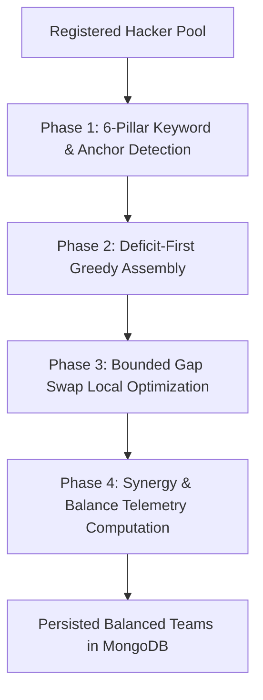

# TeamWeave — Intelligent Hackathon & Project Team Matchmaker

[](https://nodejs.org/)
[](https://www.python.org/)
[](https://www.mongodb.com/)
[](https://expressjs.com/)
[](https://fastapi.tiangolo.com/)
[](LICENSE)

**TeamWeave** is a specialized recruitment and team-building portal designed for hackathons, academic capstone projects, and innovation sprints. 

**The Hook**: Unlike naive clustering (which clusters similar programmers together, accidentally grouping 5 frontend developers on one team with no backend or database support), TeamWeave employs a **Multi-Objective Complementary Clustering Engine** to assemble **perfectly balanced, full-stack teams** spanning all six core engineering disciplines.

---

## 📑 Table of Contents

- [Key Features](#key-features)
- [System Architecture](#system-architecture)
- [The Matchmaking Algorithm](#the-matchmaking-algorithm)
- [Database Schema (MongoDB)](#database-schema-mongodb)
- [REST API Reference](#rest-api-reference)
- [Quick Start & Setup](#quick-start--setup)
- [Frontend Experience](#frontend-experience)
- [Running Automated Tests](#running-automated-tests)
- [Repository Structure](#repository-structure)
- [License](#license)

---

## ✨ Key Features

- **⚡ Complementary Full-Stack Clustering**: Ensures every team collectively spans *Frontend*, *Backend*, *Database/APIs*, *DevOps/Deployment*, *Version Control*, and *UI/UX Design*.
- **📊 Real-time Balance Telemetry**: Calculates 0–100% full-stack synergy scores, covered discipline tags, and zero-gap readiness indicators on each team card.
- **🔒 Team & Member Locking**: Organizers can lock finalized teams or individual members. Locked teams are preserved intact during subsequent clustering runs.
- **🔄 Dynamic Member Transfers**: 1-click interactive rebalancing between unlocked teams with automated audit trail logging.
- **👥 Hacker Registration**: Streamlined profile registration with multi-domain skills selection and proficiency ratings (1–5 stars).
- **💾 1-Click CSV Exports**: Download spreadsheets for Participants, Formed Teams (with full coverage scores), and Compliance Audit Trails.
- **🍃 Zero-Setup Persistent MongoDB**: Automatically launches an embedded WiredTiger MongoDB engine with on-disk storage (`data/db`), with seamless support for external MongoDB / MongoDB Atlas connection strings.
- **🐍 Optional Python FastAPI Microservice**: Dedicated high-performance microservice (`app.py`) for mathematical matching, with transparent fallback to the built-in Node.js engine.

---

## 🏛️ System Architecture

```
Client Browser (Single Page Application via index.html)
        │
        │ REST API / JSON
        ▼
Express.js Server (server.js, port 3000)
        │
        ├── ParticipantService    ──► MongoDB (participants collection)
        ├── TeamService           ──► MongoDB (teams, audit_logs collections)
        └── ClusteringService
              │
              ├── [Option 1] HTTP POST /matchmake
              │         │
              │         ▼
              │   Python FastAPI Microservice (app.py, port 8000)
              │   Coverage-Maximizing Greedy + Bounded Gap Swap
              │
              └── [Option 2] JS Coverage-Maximizing K-Means Engine (Default)
                        │
                        ▼
                  SkillVectorEncoder (Vector math, 6-pillar taxonomy)

MongoDB Collections:
  • participants    ── Hacker profiles & embedded skill ratings
  • teams           ── Formed teams with member rosters & coverage metadata
  • skills          ── 24-skill taxonomy catalog
  • audit_logs      ── Timestamped compliance event ledger
  • clustering_runs ── Algorithm execution history & duration benchmarks
```

---

## 🧠 The Matchmaking Algorithm

TeamWeave uses a 4-phase complementary clustering engine:



### 6 Full-Stack Engineering Pillars:

| Priority | Discipline Pillar | Recognized Core Competencies |
| :---: | :--- | :--- |
| **1** | **Frontend** | React, Vue.js, Angular, TypeScript, HTML/CSS, Next.js, Svelte, Tailwind |
| **2** | **Backend** | Node.js, Python, Java, C#, .NET, Go, Rust, Django, FastAPI, Spring |
| **3** | **Database/APIs** | SQL, MongoDB, PostgreSQL, GraphQL, REST API Design, Redis, Prisma |
| **4** | **DevOps/Deployment** | Docker, Kubernetes, AWS, Azure, GCP, CI/CD, GitHub Actions, Terraform |
| **5** | **Version Control** | Git, GitHub, GitLab, Bitbucket, Source Control |
| **6** | **UI/UX Design** | Figma, UI/UX Design, Sketch, Wireframing, Product Design, Adobe |

### Algorithm Workflow:
1. **Phase 1 — Anchor Seeding**: Multi-domain bridge hackers (covering multiple disciplines with high proficiency) are identified and seeded across teams as foundational anchors.
2. **Phase 2 — Deficit-First Greedy Assembly**: For each open seat, the team with the lowest coverage score selects the unassigned participant who contributes the most *new* missing pillars, breaking ties by cumulative proficiency.
3. **Phase 3 — Bounded Gap Swap Optimizer**: Runs pairwise member swaps ($O(N^2)$ bounded) between teams. A swap is executed when it elevates the global minimum coverage score without degrading any team's pre-swap baseline.
4. **Phase 4 — Telemetry Calculation**: Assigns per-team `coverageScore` (0.00–1.00), `coveredPillars`, and `missingPillars` metadata.

---

## 🗄️ Database Schema (MongoDB)

### `participants`
```json
{
  "_id": "ObjectId('...')",
  "name": "Alice Johnson",
  "email": "alice@example.com",
  "profileStatus": "Submitted",
  "skills": [
    { "skillName": "React", "category": "Frontend", "proficiencyLevel": 5 },
    { "skillName": "TypeScript", "category": "Frontend", "proficiencyLevel": 4 },
    { "skillName": "Git", "category": "DevOps", "proficiencyLevel": 3 }
  ],
  "interests": ["Web Applications", "Design Systems"],
  "createdAt": "2026-08-30T12:00:00.000Z"
}
```

### `teams`
```json
{
  "_id": "ObjectId('...')",
  "name": "Team 1",
  "eventId": 1,
  "status": "Draft",
  "isLocked": false,
  "coverageScore": 1.0,
  "coveredPillars": ["Frontend", "Backend", "Database/APIs", "DevOps/Deployment", "Version Control", "Design"],
  "missingPillars": [],
  "members": [
    {
      "participantId": "ObjectId('...')",
      "name": "Alice Johnson",
      "email": "alice@example.com",
      "skills": [...],
      "isLocked": false,
      "addedAt": "2026-08-30T12:05:00.000Z"
    }
  ],
  "createdAt": "2026-08-30T12:05:00.000Z"
}
```

---

## 🔌 REST API Reference

| Method | Endpoint | Description |
| :--- | :--- | :--- |
| `GET` | `/api/health` | Service liveness probe |
| `GET` | `/api/stats` | Dashboard metrics (total hackers, teams, average size) |
| `GET` | `/api/skills` | Fetch all 24 skills in the taxonomy catalog |
| `POST` | `/api/seed` | Seed or reset database with 12 balanced demo participants |
| `GET` | `/api/participants` | List participants (supports `?category=Frontend`, etc.) |
| `POST` | `/api/participants` | Register a new hacker profile |
| `GET` | `/api/participants/:id` | Fetch single participant by ID |
| `GET` | `/api/teams` | List formed teams with members and coverage metadata |
| `POST` | `/api/teams` | Create team manually |
| `POST` | `/api/clustering/run` | Execute complementary clustering algorithm |
| `POST` | `/api/teams/move` | Rebalance participant between teams |
| `PATCH` | `/api/teams/:id/lock` | Toggle team lock state |
| `PATCH` | `/api/teams/:id/member/:participantId/lock` | Toggle individual member lock state |
| `GET` | `/api/audit-logs` | Retrieve immutable audit ledger |
| `GET` | `/api/export/:type` | Download CSV for `participants`, `teams`, or `audit` |

---

## 🚀 Quick Start & Setup

### Prerequisites
- [Node.js](https://nodejs.org/) v18+ (tested on Node v20 & v22)
- MongoDB is **optional** — TeamWeave includes an embedded WiredTiger engine with on-disk storage.

### 1. Install Dependencies
```bash
# On Windows PowerShell:
npm.cmd install

# On macOS / Linux:
npm install
```

### 2. Start TeamWeave
```bash
# Start the server:
node server.js

# Or using npm:
npm.cmd start
```

### 3. Open the Web Portal
Open your browser and visit:
👉 **[http://localhost:3000](http://localhost:3000)**

---

## 💻 Frontend Experience

The frontend is served directly by the Express backend at `http://localhost:3000`:
- **Dashboard View**: View live talent pool metrics and discipline balance distributions.
- **Run Clustering**: Select target team size (e.g. 4) and execute the clustering pipeline.
- **Roster & Synergy Meters**: Inspect each team's full-stack readiness percentage and covered disciplines.
- **Member Transfers**: Move members between teams with instant audit trail logging.
- **Seed Demo**: Reset to a benchmark 12-hacker cross-functional dataset with 1 click.

---

## 🧪 Running Automated Tests

Run the end-to-end integration test suite verifying MongoDB operations, participant registration, clustering execution, transfers, team locking, and CSV exports:

```bash
# On Windows:
npm.cmd run test:db

# On macOS / Linux:
npm run test:db
```

---

## 🧹 Repository Cleanup Script

To automatically remove any legacy C# or redundant documentation clutter:
```bash
npm.cmd run clean
```

---

## 📁 Repository Structure

```
TeamWeave/
├── config/
│   └── db.js                  # MongoDB connection (WiredTiger Embedded + Atlas support)
├── Models/
│   ├── AuditLog.js            # Audit event schema
│   ├── ClusteringRun.js       # Clustering run history schema
│   ├── Participant.js         # Participant schema with embedded skills
│   ├── Skill.js               # 24-skill taxonomy catalog schema
│   └── Team.js                # Formed teams & full-stack coverage schema
├── Services/
│   ├── ClusteringService.js   # Coverage-maximizing greedy + gap swap balancer
│   ├── ParticipantService.js  # Participant registration & queries
│   ├── SkillVectorEncoder.js  # Vector math & 6-pillar keyword detector
│   └── TeamService.js         # Team locking, member moves, CSV exports, audit logs
├── scripts/
│   ├── clean.js               # Automated repository cleanup utility
│   ├── seed.js                # Database seeder (24 skills and 12 demo participants)
│   └── testDb.js              # End-to-end integration test runner
├── data/
│   └── db/                    # Persistent embedded MongoDB storage directory
├── app.py                     # Optional Python FastAPI matchmaking microservice
├── requirements.txt           # Python microservice dependencies
├── server.js                  # Express API server & static portal host
├── index.html                 # Cyber-glassmorphism Single Page Application
├── package.json               # NPM manifest and scripts
├── .env.example               # Environment variable configuration template
├── .gitignore                 # Git exclusions
└── README.md                  # Project documentation
```

---

## 📜 License

This project is open-source under the [MIT License](LICENSE).

